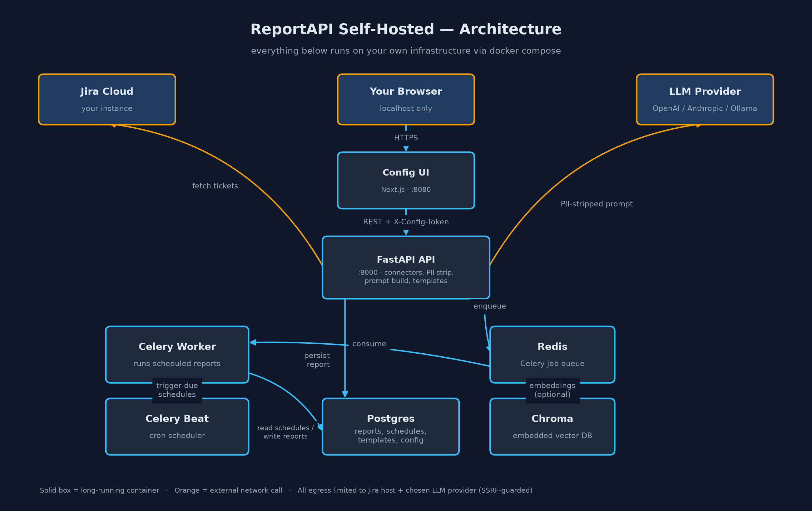
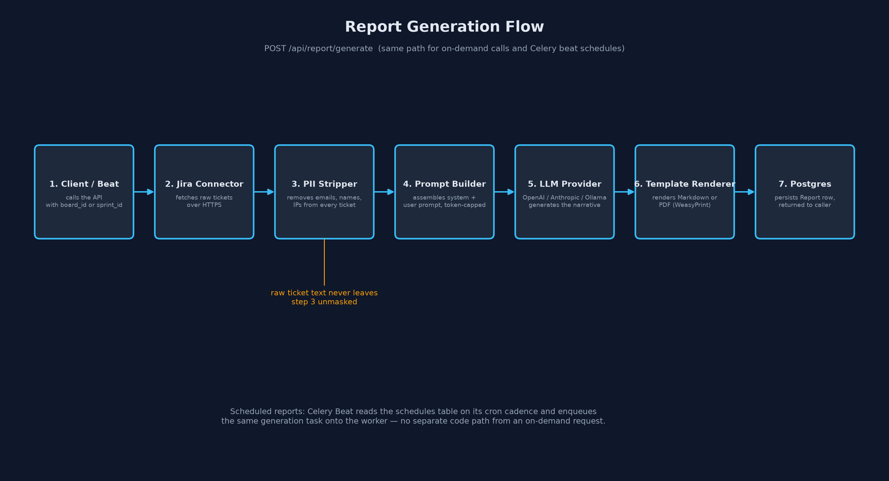

# ReportAPI Self-Hosted

A container-native reporting engine that turns your Jira or Asana board
into a written narrative report — sprint summaries, status updates,
client-facing reports, changelogs — generated by an LLM of your choice,
and run entirely on your own infrastructure.

No SaaS middleman sees your ticket data: raw ticket content is fetched
directly from your Jira/Asana instance, stripped of PII (names, emails,
IPs) inside your own containers, and only the sanitized text is sent to
the LLM provider you configure. Everything else — the API, the
scheduler, the database, the config UI — runs via `docker compose up`
on your laptop, your homelab, or a Kubernetes cluster via the bundled
Helm chart.

Jira's own tooling targets enterprise teams; ReportAPI itself is built
to be just as useful for a solo developer or a small team on Asana —
a freelancer sending a client a status update, an indie hacker
generating a weekly changelog, or a small team replacing a manual
standup writeup.

## Status

v0.5.1 — Community release. Jira + Asana connectors · OpenAI/Anthropic/Ollama ·
browser-based config UI · scheduled reports · PDF/Markdown output with
custom templates · Helm chart. See [CONTRIBUTING.md](CONTRIBUTING.md)
if you'd like to help push this toward v1.

## Table of contents

- [Concept](#concept)
- [Architecture](#architecture)
- [Report generation flow](#report-generation-flow)
- [Self-hosting on a local machine](#self-hosting-on-a-local-machine)
- [Configuration reference](#configuration-reference)
- [Using it](#using-it)
- [Running fully offline (Ollama)](#running-fully-offline-ollama)
- [Deploying on Kubernetes](#deploying-on-kubernetes)
- [Development](#development)
- [Docs](#docs)
- [Security](#security)
- [Licence](#licence)

## Concept

Engineering teams generate a lot of ticket noise — tickets, comments,
status changes — but turning that into a readable report is a manual,
recurring chore. ReportAPI automates that chore:

1. **Connect** a data source (Jira Cloud or Asana today; the connector
   interface is pluggable for more).
2. **Fetch** the tickets/tasks for a board, sprint, project, or section.
3. **Strip PII** from every ticket before it goes anywhere near a
   third-party API.
4. **Generate** a narrative using an LLM provider you control the
   choice of — OpenAI, Anthropic, or a fully local Ollama model with
   zero internet egress.
5. **Render** the result as Markdown, plain text, or a PDF, optionally
   through a custom Jinja2 template.
6. **Schedule** it to run automatically on a cron cadence, or call it
   on demand over HTTP.

The whole point of the "self-hosted" name: every one of those steps
runs inside containers you own. There's no hosted backend collecting
your ticket data — the only third parties that ever see anything are
Jira/Asana (because you're fetching from it) and whichever LLM provider
you pick (and only after PII stripping).

### Who it's for

Jira's own product targets enterprise teams. ReportAPI doesn't require
that scale — the Asana connector in particular is aimed at:

- **Freelancers/agencies** generating a clean client status update (PDF)
  without giving the client Asana/Jira access.
- **Solo developers/indie hackers** turning completed tasks into a
  weekly changelog or a personal progress log.
- **Small teams** replacing a manual standup writeup with an
  auto-generated daily/weekly digest, posted wherever they already work.
- **New-contributor handoffs** — summarizing a project's task history
  for someone joining mid-project.

## Architecture



| Component | What it is | Why it's there |
|---|---|---|
| **FastAPI API** (`app/`, `:8000`) | The core HTTP service | Connectors, PII stripping, prompt building, template rendering, report/schedule/template CRUD |
| **Config UI** (`config-ui/`, `:8080`) | Next.js app | Point-and-click setup for Jira credentials, LLM provider, and schedules — no `curl` required |
| **Celery worker** | Background job runner | Executes report generation jobs off the request path |
| **Celery beat** | Cron scheduler | Reads the `schedules` table and enqueues due reports onto the worker on cadence |
| **Postgres** | Relational store | Reports, schedules, templates, and config metadata |
| **Redis** | Job queue | Broker + result backend for Celery |
| **Chroma** | Embedded vector DB | Reserved for future semantic search over past reports; not required for core report generation |
| **Ollama** (optional, `--profile ollama`) | Local LLM runtime | Lets you run reports with zero data leaving your machine |

Every service above is defined in [`docker-compose.yml`](docker-compose.yml)
and comes up with a single `docker compose up --build`. The config UI
is published on `127.0.0.1:8080` only — it's not reachable from other
machines on your network unless you deliberately change the port
binding.

## Report generation flow



`POST /api/report/generate` is the single code path for both an
on-demand API call and a Celery-beat-triggered scheduled report — the
scheduler just calls the same generation logic (`app/core/report_service.py`)
from a worker task instead of an HTTP request.

1. **Client / Beat** — caller supplies `connector` (`jira` or `asana`) plus
   a `board_id` or `sprint_id`.
2. **Connector** (`app/connectors/jira.py`, `app/connectors/asana.py`) —
   fetches raw tickets/tasks over HTTPS. Jira's user-supplied URL is
   SSRF-guarded (only your configured Jira host is ever contacted — see
   [`app/core/ssrf_guard.py`](app/core/ssrf_guard.py)); Asana's API host
   is fixed, so no user-supplied URL exists to guard.
3. **PII Stripper** (`app/core/pii.py`) — removes emails, personal
   names, and IP addresses from every ticket. This runs before step 4;
   unmasked ticket text never reaches the prompt builder or the LLM.
4. **Prompt Builder** (`app/core/prompt_builder.py`) — assembles the
   system and user prompt, capped to `MAX_TOKENS_OUTPUT`.
5. **LLM Provider** (`app/llm/`) — whichever of OpenAI, Anthropic, or
   Ollama you've configured generates the narrative.
6. **Template Renderer** (`app/core/template_renderer.py`,
   `app/core/pdf_renderer.py`) — renders Markdown, plain text, or PDF
   (via WeasyPrint), optionally through a custom template.
7. **Postgres** — the resulting `Report` row is persisted and returned
   to the caller.

## Self-hosting on a local machine

### Prerequisites

- [Docker](https://docs.docker.com/get-docker/) and Docker Compose v2
  (`docker compose`, not the old `docker-compose`)
- A Jira Cloud account with an [API token](https://id.atlassian.com/manage-profile/security/api-tokens)
- An API key for at least one LLM provider (OpenAI, Anthropic) —
  unless you're running fully offline with Ollama

### 1. Clone the repo

```bash
git clone https://github.com/utkarshmankad/reportapi-selfhosted.git
cd reportapi-selfhosted
```

### 2. Configure environment variables

```bash
cp .env.example .env
```

Edit `.env` and fill in at minimum one connector plus one LLM provider:

```dotenv
# Jira
JIRA_URL=https://yourcompany.atlassian.net
JIRA_EMAIL=you@company.com
JIRA_API_TOKEN=your-jira-api-token

# — or Asana, instead of/alongside Jira —
ASANA_PAT=your-asana-personal-access-token

LLM_PROVIDER=openai        # or anthropic / ollama
OPENAI_API_KEY=sk-...
```

See [Connector setup](docs/connector-setup.md) for how to mint a Jira
API token or an Asana Personal Access Token.

`DATABASE_URL` and `REDIS_URL` already point at the `postgres` and
`redis` service names in `docker-compose.yml` — leave them as-is for
local use. See [Configuration reference](#configuration-reference)
below for every variable.

### 3. Bring the stack up

```bash
docker compose up --build
```

This builds and starts: `api`, `worker`, `beat`, `config-ui`,
`postgres`, `redis`, and `chroma`. First build takes a few minutes
(WeasyPrint's system dependencies, Python deps, and the Next.js
build). Subsequent starts are fast.

Run database migrations once the `postgres` container is healthy:

```bash
docker compose exec api alembic upgrade head
```

### 4. Verify it's up

```bash
curl http://localhost:8000/health
```

should return a JSON status payload. Then open
**http://localhost:8080** in a browser for the config UI, where you
can re-enter/validate your Jira and LLM credentials and set up
recurring schedules without touching the CLI.

### 5. Generate your first report

Via the config UI, or directly:

```bash
curl -X POST http://localhost:8000/api/report/generate \
  -H "Content-Type: application/json" \
  -d '{"connector": "jira", "board_id": "YOUR_PROJECT_KEY"}'

# or, for Asana:
curl -X POST http://localhost:8000/api/report/generate \
  -H "Content-Type: application/json" \
  -d '{"connector": "asana", "board_id": "YOUR_ASANA_PROJECT_GID"}'
```

### 6. Stopping / cleaning up

```bash
docker compose down          # stop containers, keep data volumes
docker compose down -v       # stop and wipe Postgres/Chroma/Ollama volumes
```

## Configuration reference

All variables live in `.env` (see [`.env.example`](.env.example) for
the canonical list).

| Variable | Required | Default | Purpose |
|---|---|---|---|
| `APP_ENV` | no | `development` | `development` or `production` |
| `LOG_LEVEL` | no | `info` | Uvicorn/app log level |
| `DATABASE_URL` | yes | points at `postgres` service | Async SQLAlchemy connection string |
| `REDIS_URL` | yes | points at `redis` service | Celery broker/result backend |
| `JIRA_URL` | for Jira reports | — | Your Jira Cloud base URL |
| `JIRA_EMAIL` | for Jira reports | — | Jira account email |
| `JIRA_API_TOKEN` | for Jira reports | — | [Atlassian API token](https://id.atlassian.com/manage-profile/security/api-tokens) |
| `ASANA_PAT` | for Asana reports | — | [Asana Personal Access Token](https://app.asana.com/0/my-apps) |
| `LLM_PROVIDER` | yes | `openai` | `openai`, `anthropic`, or `ollama` |
| `OPENAI_API_KEY` | if provider is `openai` | — | OpenAI API key |
| `ANTHROPIC_API_KEY` | if provider is `anthropic` | — | Anthropic API key |
| `CONFIG_API_TOKEN` | recommended off-localhost | unset | If set, `/api/config/*` requires this value as the `X-Config-Token` header. Leave blank for pure localhost use; **set it** the moment port `8000` is reachable from anywhere other than your own machine |

## Using it

### Config UI (recommended)

Open **http://localhost:8080**. From there you can:

- Test and save Jira or Asana credentials
- Choose and test an LLM provider
- Trigger a report on demand
- Create/edit/delete recurring schedules
- Manage custom templates

### API directly

| Endpoint | Method | Purpose |
|---|---|---|
| `/health` | GET | Liveness check |
| `/api/report/generate` | POST | Generate a report now (`connector`: `jira` or `asana`, `board_id` or `sprint_id`, optional `output_format`) |
| `/api/report/{report_id}/render` | GET | Render a stored report (Markdown/text/PDF) |
| `/api/schedule` | GET/POST | List / create recurring report schedules |
| `/api/schedule/{id}` | DELETE | Remove a schedule |
| `/api/templates` | GET/POST | List / create custom report templates |
| `/api/templates/{id}` | GET | Fetch a template |
| `/api/config` | GET | Current config status (requires `X-Config-Token` if `CONFIG_API_TOKEN` is set) |
| `/api/config/jira`, `/api/config/jira/test` | POST | Save/test Jira credentials |
| `/api/config/asana`, `/api/config/asana/test` | POST | Save/test Asana credentials |
| `/api/config/llm`, `/api/config/llm/test` | POST | Save/test LLM provider credentials |

Full endpoint list is browsable live at **http://localhost:8000/docs**
(FastAPI's built-in Swagger UI).

## Running fully offline (Ollama)

For zero external LLM traffic, run a local model via Ollama:

```dotenv
# .env
LLM_PROVIDER=ollama
```

```bash
docker compose --profile ollama up --build
```

This starts an additional `ollama` container and pulls `llama3.2` on
first boot. Ticket data still needs Jira (unless you're testing with
sample data), but nothing is sent to any external LLM API.

## Deploying on Kubernetes

A Helm chart lives in [`helm/reportapi/`](helm/reportapi/):

```bash
helm install reportapi ./helm/reportapi \
  --set envSecret.JIRA_API_TOKEN=... \
  --set envSecret.OPENAI_API_KEY=...
```

See [`helm/reportapi/values.yaml`](helm/reportapi/values.yaml) for the
full set of overrides (replica counts, image tags, service types).

## Development

```bash
poetry install
cp .env.example .env
docker compose up --build
```

Run the test suite before opening a PR:

```bash
poetry run pytest
```

CI (`.github/workflows/ci.yml`) runs unit tests, integration tests
against a real Postgres, a security scan (Bandit + pip-audit + SSRF
regression tests), and an end-to-end docker-compose smoke test on
every push. See [CONTRIBUTING.md](CONTRIBUTING.md) for the full
workflow.

## Docs

- [Quickstart](docs/index.md)
- [Connector setup](docs/connector-setup.md)
- [LLM configuration](docs/llm-config.md)
- [Template guide](docs/template-guide.md)

## Security

- PII stripping runs on every ticket before it reaches any LLM
  (`app/core/pii.py`).
- Outbound requests are SSRF-guarded — the API will only contact the
  Jira host and LLM provider you've configured (`app/core/ssrf_guard.py`).
- Config endpoints (`/api/config/*`) support token-gated auth via
  `CONFIG_API_TOKEN` — set this whenever port `8000` is reachable
  beyond your own machine.
- Found a vulnerability? See [SECURITY.md](SECURITY.md) for responsible
  disclosure.

## Licence

MIT — see [LICENSE](LICENSE). The Community tier requires no license
key and every feature described in this README is available in it. A
paid-tier scaffold exists (`app/core/license_gate.py`) for possible
future premium features; nothing in the current feature set is gated
behind it.
